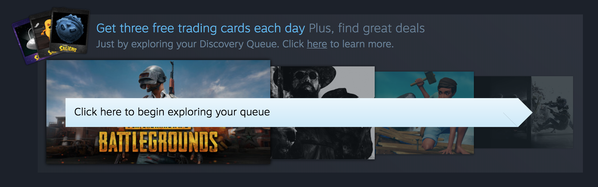
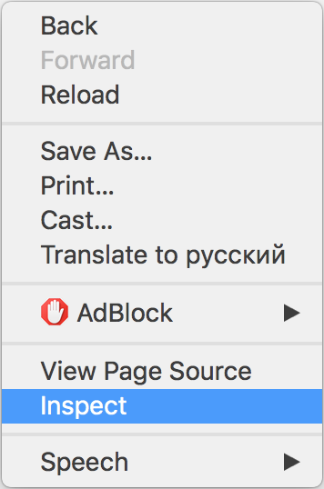

# Steam Queue Auto Discover
This small script saves you some minutes every day if you are collecting Steam Sale cards.

## How to?
There are two ways to use this script:

### Directly from browser console:
1. Open [Steam Queue Explore Page](https://store.steampowered.com/explore/)
2. Do `right click` on opened page and open web-inspector

    
3. Open `Console`
4. Insert [script](https://raw.githubusercontent.com/denissdubinin/Steam-Queue-Auto-Discover/master/queue.js) in console and press `Enter`

### Using browser extension:
*Using this way script will be triggered each time you will open [Steam Queue Explore](https://store.steampowered.com/explore) page.*
1. Install browser extension:
    [Chrome](https://chrome.google.com/webstore/detail/tampermonkey/dhdgffkkebhmkfjojejmpbldmpobfkfo),
    [Firefox](https://addons.mozilla.org/en-US/firefox/addon/tampermonkey/),
    [Opera](https://addons.opera.com/en/extensions/details/tampermonkey-beta/),
    [Safari](https://tampermonkey.net/?browser=safari)
2. Open [Script page](https://raw.githubusercontent.com/denissdubinin/Steam-Queue-Auto-Discover/master/queue.user.js)
4. Click `Install`
3. Open [Steam Queue Explore Page](https://store.steampowered.com/explore)

## Is there any risks?
No, this script emulates web requests, Steam will see these requests as real queue visits.

## Note
Please note, that you can get only 3 cards per day and only during Steam Sale.

## Issue reporting
Faced with any issue? [Report the issue](https://github.com/denissdubinin/Steam-Queue-Auto-Discover/issues) or [fix it by yourself](https://github.com/denissdubinin/Steam-Queue-Auto-Discover/pulls). You are welcome 😊
